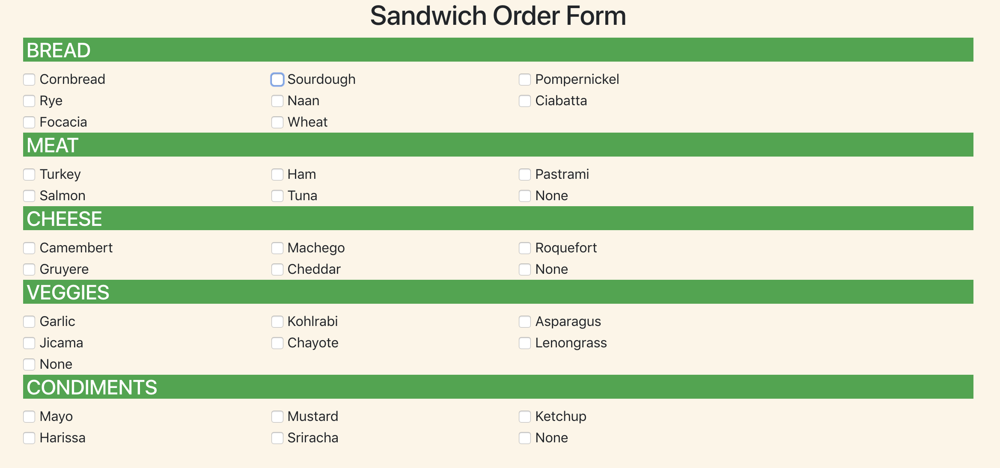

# Sandwich Maker

### Description 
A simple sandwich builder form

### Technology Used
> * HTML
> * CSS
> * Javascript
> * Bootstrap 4

### Screenshot


### Instructions
```
1. Go to: `https://www.npmjs.com/package/http-server` and install "http-server".  
2. Navigate to the project folder in command line interface and type: `http-server -p 8080`  
3. This will show at: `http://localhost:8080` in your internet browser.  
```
