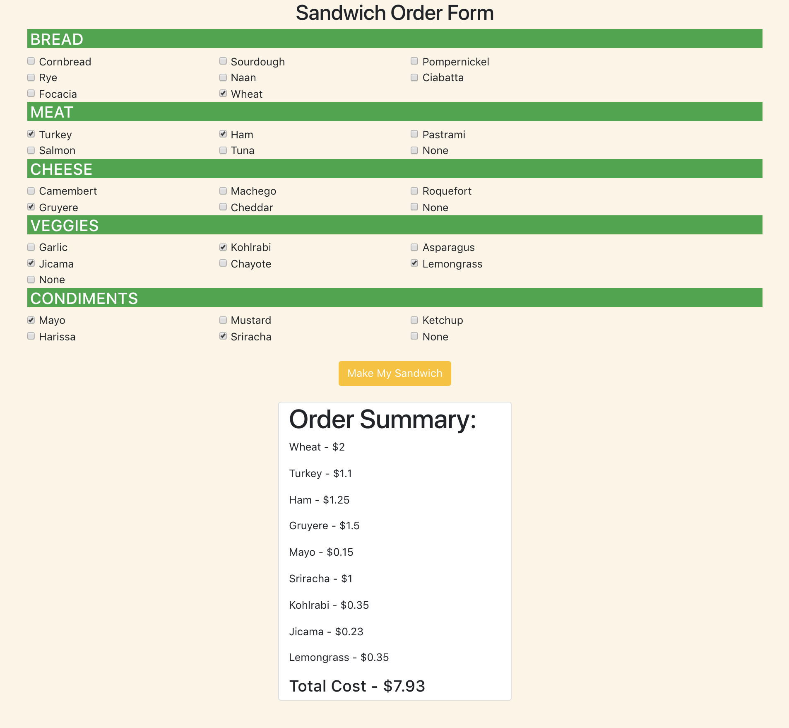

# Sandwich Maker

### Description 
This app is a sandwich order form. When the page loads the user can select all ingredients for a custom deli sandwich displayed as checkboxes. The user has to choose from various selections of breads, meats, cheeses, veggies, and condiments. User can select multiple, or zero choices for each section, such as "turkey and roast beef" or "no meat". Once the user has made all selections, they can press the 'Make My Sandwich' button. Doing so will reveal a the price for each selected ingredient, and total price for the whole sandwich.

### Technologies Used
* HTML
* CSS
* Vanilla JavaScript
* Bootstrap 4

### Screenshots

### Instructions
1. Go to: `https://www.npmjs.com/package/http-server` and install "http-server".  
2. Navigate to the project folder in command line interface and type: `http-server -p 8080`  
3. This will show at: `http://localhost:8080` in your internet browser.  
